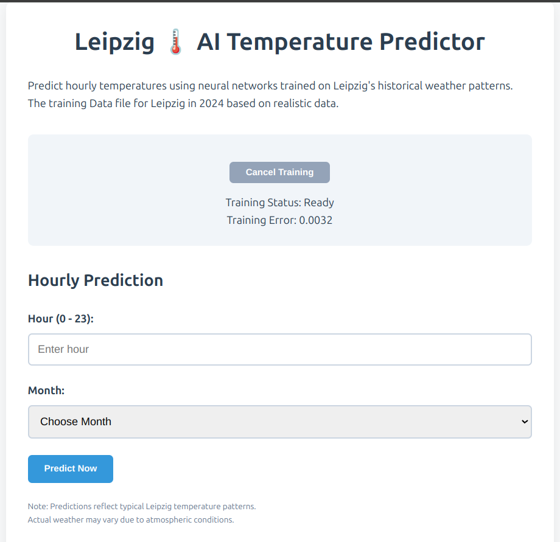
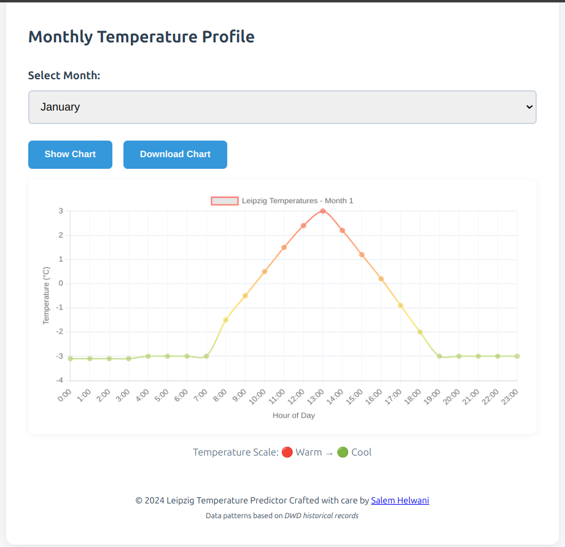

# Leipzig AI Temperature Predictor

[](https://opensource.org/licenses/MIT)
[](https://github.com/salimov333/)




## Description

The **Leipzig AI Temperature Predictor** is an AI-powered web application that predicts hourly temperatures in Leipzig, Germany using neural networks. Trained on historical weather patterns, it provides:

- Real-time model training visualization 📈
- Interactive temperature predictions 🌡️
- Detailed hourly temperature charts 📊
- Persistent prediction history 📅

## ✨ Key Features

- 🧠 Neural Network Training with Brain.js
- ⏳ Real-Time Training Progress Visualization
- 🔮 Temperature Prediction Interface
- 📈 Chart.js Interactive Visualizations
- 💾 LocalStorage Prediction History
- 📱 Responsive Mobile-Friendly Design
- ♿ Accessibility-First Approach
- 🎨 Temperature Gradient Charts
- ⚡ Web Worker Background Processing

## 🚀 Getting Started

1. **Live Demo**: [Click Here](https://salimov333.github.io/ai-temperature-predictor/)
2. **Local Usage**:
   ```bash
   git clone https://github.com/salimov333/ai-temperature-predictor.git
   cd ai-temperature-predictor
   # Open index.html in modern browser
   ```

## ⚙️ Technologies Used

- **Brain.js** - Neural Network Library
- **Chart.js** - Data Visualization
- **Web Workers** - Background Training
- **LocalStorage** - Prediction History
- **Modern CSS** - Responsive Design
- **ES6 JavaScript** - Core Logic

## 🌐 Browser Support

| Browser | Version |
| ------- | ------- |
| Chrome  | 90+     |
| Firefox | 85+     |
| Safari  | 14+     |
| Edge    | 90+     |

## 🤝 Contributing

1. Fork the repository
2. Create feature branch (`git checkout -b feature/AmazingFeature`)
3. Commit changes (`git commit -m 'Add AmazingFeature'`)
4. Push to branch (`git push origin feature/AmazingFeature`)
5. Open Pull Request

## 📜 License

MIT License - See `LICENSE` for details

## ✍️ Author

**Salem Helwani**  
[GitHub](https://github.com/salimov333)

## 🙏 Acknowledgements

- German Weather Service (DWD) for historical data
- Brain.js team for neural network library
- Chart.js for visualization capabilities
- Leipzig climate researchers

---

**Predict Leipzig's Temperatures with AI Precision!** 🔮🌡️

```

```
